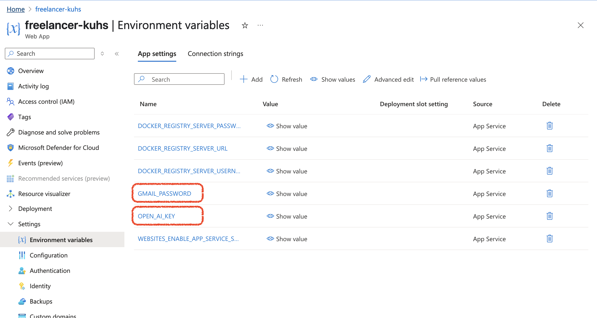

# Application Secrets

The `application.properties` file contains key-value pairs of configuration settings. To avoid exposing sensitive keys publicly on GitHub, you can create environment variables in Azure with a NAME and value for your property (for example, the OpenAI API key). Then, use that NAME in the properties file like `${NAME}`.

Below is an example of how two variables were created in Azure: `OPEN_AI_KEY` and `GMAIL_PASSWORD`. The values were referenced in the `application.properties` file.



```properties
# `application.properties` file
spring.ai.openai.api-key=${OPEN_AI_KEY}

spring.mail.password=${GMAIL_PASSWORD}
```

**Note:** You should commit and push the version of `application.properties` with the `${NAME}` placeholders to GitHub. To run the code locally, you can either set the environment variables or (more easily) replace the `${NAME}` placeholders with the actual values—just make sure not to commit and push the file with real secrets.