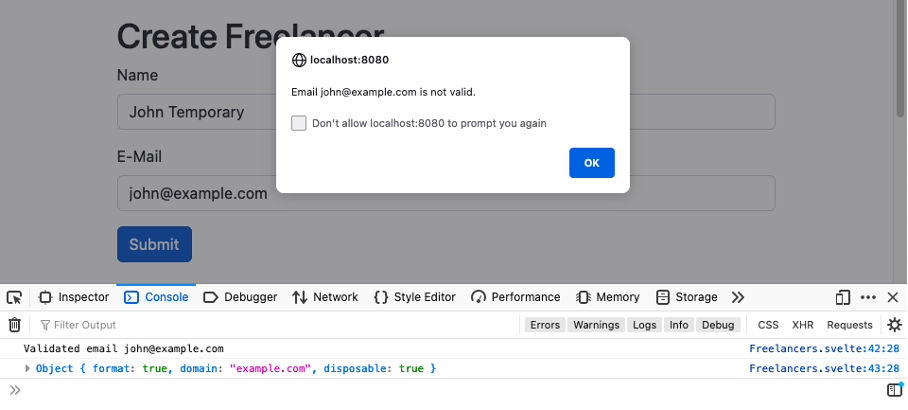
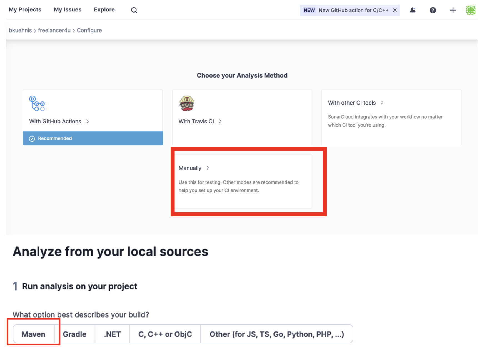
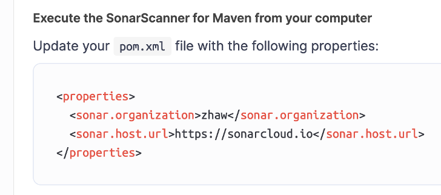
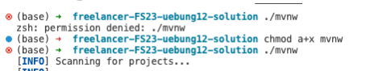

# 🧪 Übung 12 - API-Anbindung und Code-Analyse

**Themen:** Anbindung von Drittsystemen, E-Mail-Validierung, E-Mail-Versand, Code-Analyse

Diese Übung besteht aus drei Teilen:  
1. **E-Mail-Validierung:** Integration der API [Disify](https://www.disify.com/) im Frontend und Backend zur Überprüfung von E-Mail-Adressen.  
2. **E-Mail-Versand:** Automatisches Versenden von E-Mails bei bestimmten Aktionen.  
3. **Code-Analyse:** Statische Analyse des Projekts mit [SonarCloud](https://sonarcloud.io), inklusive Behebung von Bugs, Sicherheitsproblemen oder Code Smells.

---

## 📎 Abgabe

**Folgendes Artefakt ist über Moodle einzureichen:**

- Die **URL** eines privaten GitHub-Repositories  
- Das Repository muss für die Dozierenden freigegeben sein  
- Es enthält die implementierten **Java-Klassen**

---

## 🛠️ Teil 1.  E-Mail-Validierung
Zu Beginn mach dich mit der API vertraut, indem du die Dokumentation der API liest. Beachte dabei, dass wir nur die Funktion "Single Email Address" (siehe https://docs.disify.com/#single-email-address) mit dem Parameter "Email" verwenden werden. Als nächstes teste die API mit Postman. Das Ergebnis sollte in etwa wie folgt aussehen.

Wir definieren, dass eine E-Mail-Adresse Valid ist, wenn die Properties folgenden Wert haben.
-	format : true
-	disposable: false
-	dns: true

---


Ein Beispiel mit einer temporären Domain zeigt, wie die API eine ungültige E-Mail-Adresse erkennt. Temporäre Domains werden häufig für einmalige oder anonyme E-Mail-Adressen verwendet und sind daher für die meisten Anwendungen ungeeignet. Die API überprüft, ob die Domain der E-Mail-Adresse als temporär eingestuft ist, und markiert diese entsprechend.

---


Ein Beispiel mit einer validen Domain.

---

### 1.1 Validierung im Frontend

Als erstes wird die API im Frontend verwenden. Dabei benutzen wir die Library axios. Die folgende Funktion muss in der Datei `companies/ +page.svelte` vor der Funktion `createCompany` hinzugefügt werden.
```javascript
function validateEmailAndCreateCompany(){
    var config = {
            method: "get",
            url: "https://disify.com/api/email/" + company.email
        };

    axios(config)
        .then(function (response) {
            console.log("Validated email "+ company.email);
            console.log(response.data);
            if (response.data.format && !response.data.disposable 
               && response.data.dns){
                createCompany();
            } else {
                alert("Email " + company.email + " is not valid.");
            }
        })
        .catch(function (error) {
            alert("Could not validate email");
            console.log(error);
        });
}
```
Anschliessend muss noch der on:click event des Submits Button geändert werden. Damit beim on:click die Validierungsfunktion "validateEmailAndcreateCompany" aufgerufen wird.

```html
<button type="button" class="btn btn-primary" onclick={validateEmailAndCreateCompany}>Submit</button>
```

Wenn eine ungültige oder temporäre E-Mail-Adresse verwendet wird, wird folgende Meldung angezeigt:


### 1.2 Umgehen der Client-Validierung

Die Validierung findet bisher ausschliesslich im Frontend statt. Diese kann vom Benutzer umgangen werden, indem er den Client-Code verändert. Hierfür gibt es mehrere Möglichkeiten, eine davon besteht darin, dass die API um eine Company zu erstellen via Postman aufgerufen wird.

### 1.3 Validierung im Backend
Um sicherzustellen, dass die E-Mail-Adresse beim Erstellen einer Company gültig ist, werden wir dieselbe API im Backend erneut aufrufen. Die Validierung im Frontend bleibt dennoch sinnvoll, damit der Benutzer schnelleres Feedback erhält und die Applikation weniger Traffic für das Backend verursacht.
Dazu müssen die folgenden Pakete installiert werden: `spring-boot-starter-webflux`. 


Als Erstes erstellen wir eine Utility-Klasse namens "ServiceUtils" im Ordner "service", um die Requests in der Konsole zu protokollieren.


```java
package ch.zhaw.freelancer4u.service;

import org.slf4j.Logger;
import org.springframework.web.reactive.function.client.ExchangeFilterFunction;

public class ServiceUtils {
    public static ExchangeFilterFunction logRequest(Logger logger) {
        return (clientRequest, next) -> {
            logger.info("Request: {} {}", clientRequest.method(), clientRequest.url());
            clientRequest.headers()
                    .forEach((name, values) -> values.forEach(value -> logger.info("{}={}", name, value)));
            return next.exchange(clientRequest);
        };
    }
}
```

Nun erstellen wir die Klasse `MailInformation` im Ordner `model`, welche wir benötigen werden, um die Antwort der API in ein Java Objekt zu serialisieren.


```java
package ch.zhaw.freelancer4u.model;

import lombok.Getter; 
import lombok.NoArgsConstructor;

/**
 * Represents a response object for the api https://docs.disify.com/
 * 
 * For informations about the properties see: https://docs.disify.com/?java#json-response-parameters
 **/
@Getter
@NoArgsConstructor
public class MailInformation{
    private boolean format;
    private boolean alias;
    private String domain;
    private boolean disposable;
    private boolean dns;
}
```

Um die API aufzurufen, erstellen wir einen neuen Service `MailValidatorService` im Ordner `service`.

```java
package ch.zhaw.freelancer4u.service;

import java.time.Duration;
import org.slf4j.LoggerFactory;
import org.slf4j.Logger;
import org.springframework.beans.factory.annotation.Autowired;
import org.springframework.stereotype.Service;
import org.springframework.web.reactive.function.client.WebClient;

import ch.zhaw.freelancer4u.model.MailInformation;

import org.springframework.http.HttpHeaders;
import org.springframework.http.MediaType;

@Service
public class MailValidatorService {
    private static final String DISIFY_EMAIL_VALIDATOR_BASE_URL = "https://www.disify.com";

    private static final Duration REQUEST_TIMEOUT = Duration.ofSeconds(3);
    private static final String USER_AGENT = "Spring 5 WebClient";
    private static final Logger logger = LoggerFactory.getLogger(MailValidatorService.class);
    private final WebClient webClient;

    @Autowired
    public MailValidatorService() {
        this.webClient = WebClient.builder()
                .baseUrl(DISIFY_EMAIL_VALIDATOR_BASE_URL)
                .defaultHeader(HttpHeaders.CONTENT_TYPE, 
                               MediaType.APPLICATION_JSON_VALUE)
                .defaultHeader(HttpHeaders.USER_AGENT, USER_AGENT)
                .filter(ServiceUtils.logRequest(logger))
                .build();
    }

    public MailInformation validateEmail(String email) {
        return webClient
                // http-method
                .get()
                // uri to api
                .uri("/api/email/" + email)
                // Proceed to declare how to extract the response.
                .retrieve() 
                // mapping to a certain class
                .bodyToMono(MailInformation.class) 
                //Optional: pass a timeout for the request
                //Blocks until next signal is received or the timeout expires
                .block(REQUEST_TIMEOUT);
    }
}
```

Nun müssen wir im `CompanyController` folgende Property hinzufügen.

```java
    @Autowired
    MailValidatorService mailValidatorService;
```

### 1.4 Aufgabenstellung
In der Funktion `createCompany` soll die `validateEmail` Funktion des Service `EmailValidatorService` aufgerufen werden. Dabei soll, wie im Frontend überprüft werden, ob die E-Mail-Adresse gültig und nicht zu einer temporären Domain gehört. Fall die E-Mail-Adresse ungültig ist kann folgendes zurückgegeben werden.

```java
return new ResponseEntity<>(HttpStatus.BAD_REQUEST);
```

Du kannst deine Umsetzung mit Postman überprüfen. 


## ✨ Teil 2: E-Mail senden

E-Mails können über SMTP (siehe https://en.wikipedia.org/wiki/Simple_Mail_Transfer_Protocol) versendet werden. Damit du E-Mails versenden kannst, musst du deine eigene E-Mail-Adresse verwenden. Es empfiehlt sich, eine neue E-Mail-Adresse zu erstellen, damit du dein Passwort nicht im Code speichern musst. Diese Anleitung wird mit dem E-Mail Dienst https://gmail.com.
1. Erstelle einen neuen Gmail Account.
2. Bei dem User-Icon oben rechts wähle `Manage your Google Account` aus.
3. Aktiviere `2-Step Verification` zB. mit deiner Mobiltelefonnummer unter Security -> How you sign in to Google.
4. Erstelle ein App Password unter https://myaccount.google.com/apppasswords
    1. Speichere das Password, da es anschliessend nicht mehr ersichtlich sein wird. Leerzeichen gehören zum Password.
    2. App Password Menu wird unter `2-Step Verification` angezeigt, nachdem du das erste App Password erstellt hast.

Hinweise: 
-	Gewisse E-Mail Provider erlauben es aus Sicherheitsbedenken nicht mehr, Drittapplikationen sich via E-Mail-Password zu Authentifizieren. Ein Beispiel dazu ist https://outlook.com. Informationen zur Konfiguration von outlook findest du hier: https://learn.microsoft.com/en-us/entra/msal/java/. Dies ist jedoch mit einer ZHAW-E-Mail nicht möglich, da wir die Berechtigungen nicht haben. 

Folgende Maven dependency muss hinzugefügt werden: `spring-boot-starter-mail`

 

In der Datei `application.properties` füge folgende Properties hinzu und ändere den Wert von Username mit deiner E-Mail und password mit dem Apps Password, welches du erstellt hast.

```
spring.mail.host=smtp.gmail.com
spring.mail.port=587
spring.mail.username=[DEINE EMAIL]@gmail.com
spring.mail.password=[DEIN APP PASSWORD]
spring.mail.properties.mail.smtp.auth=true
spring.mail.properties.mail.smtp.starttls.enable=true
spring.mail.properties.mail.debug=true
```
 
Anschliessend erstellen wir die Model Klasse `Mail`.

```java
package ch.zhaw.freelancer4u.model;

import lombok.Getter;
import lombok.Setter;
import lombok.NoArgsConstructor;

@Getter
@Setter
@NoArgsConstructor
public class Mail {
    private String to;
    private String subject;
    private String message;
}
```

Um die E-Mails zu versenden, erstellen wir die Klasse `MailService`.

```java
package ch.zhaw.freelancer4u.service;

import org.springframework.beans.factory.annotation.Autowired;
import org.springframework.mail.SimpleMailMessage;
import org.springframework.mail.javamail.JavaMailSender;
import org.springframework.stereotype.Service;
import ch.zhaw.freelancer4u.model.Mail;

@Service
public class MailService {
    @Autowired
    private JavaMailSender mailSender;

    public boolean sendMail(Mail mail) {
        try {
            SimpleMailMessage message = new SimpleMailMessage();
            message.setTo(mail.getTo());
            message.setSubject(mail.getSubject());
            message.setText(mail.getMessage());
            mailSender.send(message);
            return true;
        } catch (Exception e) {
            e.printStackTrace();
            return false;
        }
    }
}
```

### 1.1 Aufgabenstellung
Ändere den Code des Controllers `JobServiceController` so, dass beim Zuweisen oder Abschliessen eines Jobs eine E-Mail an die entsprechende Person versendet wird. Das Versenden der E-Mail soll in den folgenden Methoden implementiert werden: `assignToMe`, `completeMyJob`. Um die E-Mail zu versenden, soll die Klasse `MailService.java` verwendet werden. Die E-Mail sollte den aktuellen Status des Jobs enthalten. Ein Beispiel dazu findest du im folgenden Bild.
 


## ✨ Teil 3: Code Analyse mit Sonarcloud
Das Ziel dieses Abschnittes ist es zu zeigen, wie das Projekt Freelancer4U mit Sonarcloud analysiert werden kann. 
1.	Erstelle ein Account auf https://sonarcloud.io.

2.	Erstelle ein neues Projekt auf Sonarcloud.
  

3.	Wähle `create a project manually`  


4.	Wähle `Create another organization` und dann `create one manually` und erstellt eine Organisation. Dabei spielt der Name keine Rolle. Wähle den `Free plan` aus und dann `Create Organisation`.
 
 
5.	Fülle folgende Felder aus. Der `Project key` muss über alle Projekte auf Sonarcloud eindeutig sein. Du kannst zum Beispiel folgenden Key verwenden: ch.zhaw.[kürzel].freelancer4u
 


 
6.	Wähle `Previous version` aus und `Create project`
 

7.	Anschliessend wähle `Manually` und dann Maven aus. 
 

8.	Füge den Text in der Anleitung der Datei `pom.xml` hinzu.  


9. **Applikation testen und Unit-Tests ausführen**  
Damit die statische Analyse durchgeführt werden kann, muss die Applikation lauffähig sein und alle Unit-Tests erfolgreich durchlaufen.  
- Starte die Applikation und führe alle Unit-Tests aus.  
- **Hinweis**: Falls ein Unit-Test fehlschlägt und du den Fehler nicht beheben kannst, kannst du den Test mit der Annotation `@Disabled` vorübergehend deaktivieren.

10. **Sonarcloud-Befehl ausführen**  
- Kopiere den Befehl aus der Anleitung und füge den zusätzlichen Parameter `-Dsonar.token=` mit dem Wert deines `SONAR_TOKEN` hinzu.  
- Ersetze `mvn` durch `mvnw`, um den Wrapper zu verwenden.  
- Führe den Befehl im Terminal in Visual Studio Code aus.

**Beispiel-Befehl:**  
- **Windows** (im cmd ausführen):  
```bash
  mvnw verify org.sonarsource.scanner.maven:sonar-maven-plugin:sonar -Dsonar.projectKey=freelancer4u -Dsonar.token=<YOUR_TOKEN>
```
- **Mac:**  
```bash
./mvnw verify org.sonarsource.scanner.maven:sonar-maven-plugin:sonar -Dsonar.projectKey=freelancer4u -Dsonar.token=<YOUR_TOKEN>

./mvnw verify org.sonarsource.scanner.maven:sonar-maven-plugin:sonar -Dsonar.projectKey=freelancer4ufs25_kuhs-freelancer-4u -Dsonar.token=7da1616e8335df40bba2323b3dbefd06e8c1d4a0
```

11.	Damit die statische Analyse durchgeführt werden kann, muss die Applikation lauffähig sein und alle Unit-Test gehen. 
Starte die Applikation, um dies zu testen und führe alle Unit-Tests durch. 
Hinweis: Falls einen Unit-Test nicht geht und Du nicht weisst warum, kannst du diesen mit der Annotation `@Disabled` ausschalten.

12.	Aus der Anleitung kopieren wir zuerst den Befehl und fügen noch ein weiterer Parameter `-Dsonar.token=` mit dem Wert des `SONAR_TOKEN` hinzu. Zusätzlich müssen wir noch `mvn` durch `mvnw` ersetzen. Diesen Befehl führen wir im Terminal in Visual Studio Code aus.
 
 


Hinweis Mac:
Bei einem `permission denied` Fehler muss die Ausführberechtigung hinzugefügt werden. Dazu müsst ihr folgenden Befehl im Terminal ausführen: `chmod a+x` 
 
 
13.	Bei einem Erfolgreichem Build sieht sollte die Konsole etwa so aussehen.  

Zusätzlich ist nun der Code sowie die statische Code-Analyse in Sonarcloud ersichtlich.

 

Nun kannst du die Bugs, Security Review oder Code Smells analysieren. Du findest immer eine Erklärung zum Fehler unter `Why is this an issue`.
 

### 3.1 Aufgabenstellung
Analysiere dein Projekt mit Sonarcloud. Falls dein Projekt einen Bug oder Code Smell hat, behebe mindestens drei und führe die Analyse des Projekts nochmals aus und überprüfe, ob der Bug, Security Review oder Code Smell behoben sind.