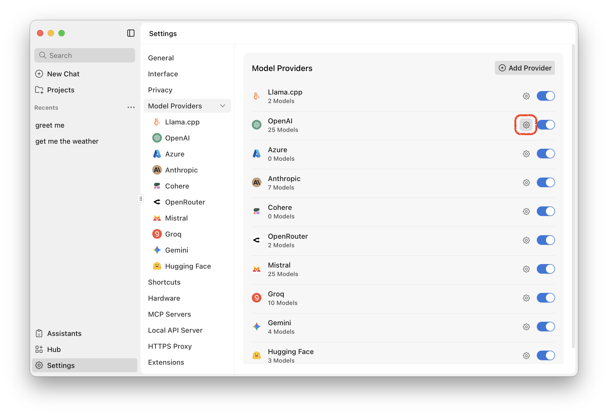
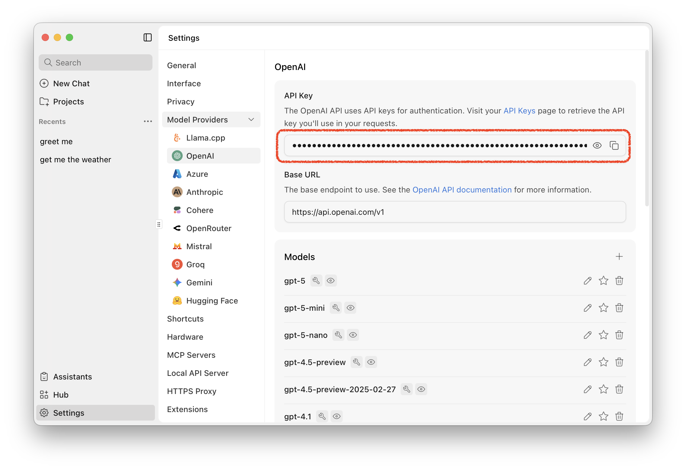
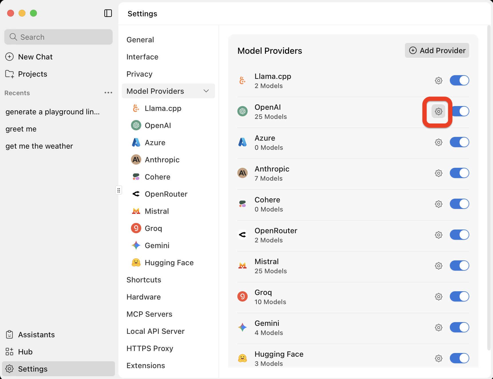
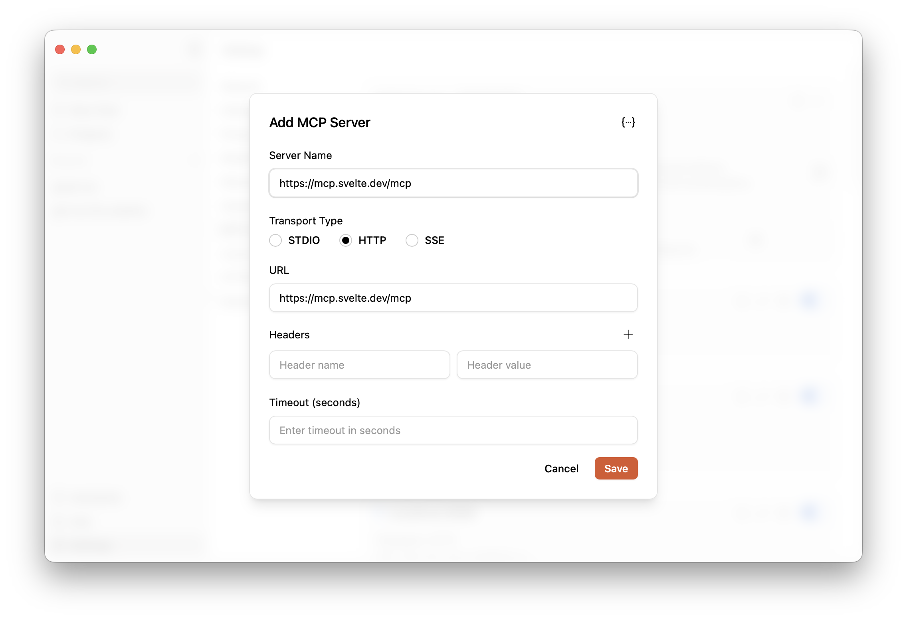
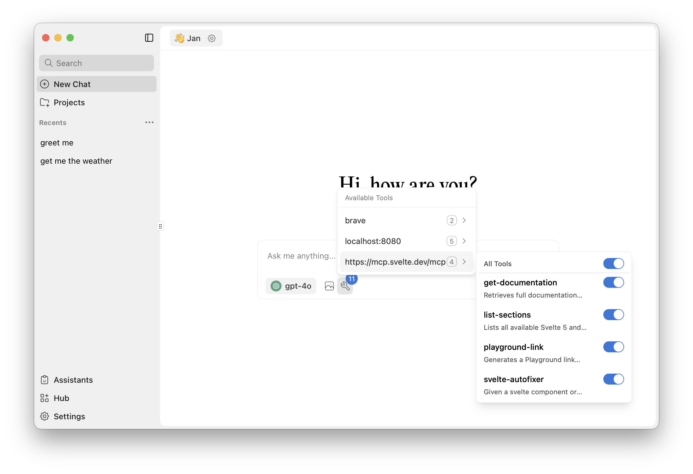
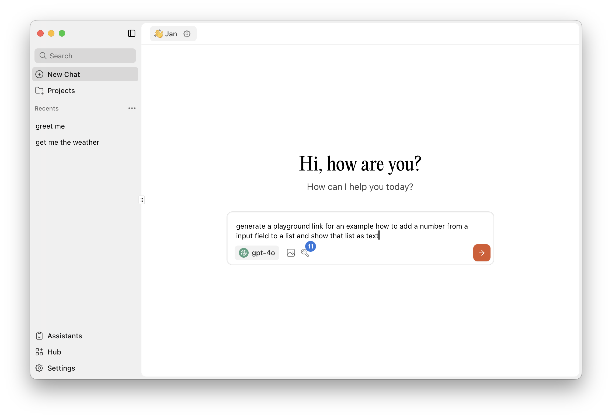
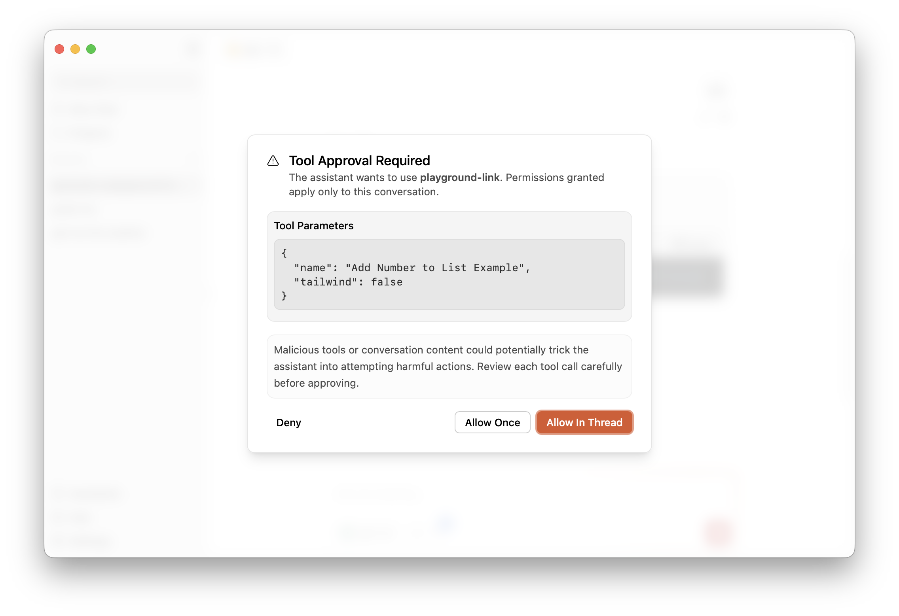
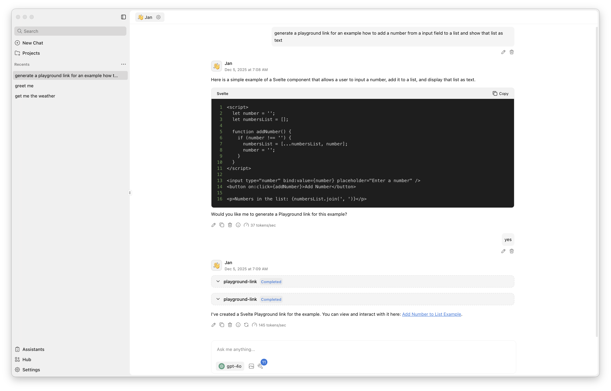

# 🧪 Übung 13 - MCP Server

Themen: Erstellung, Absicherung und Deployment eines MCP-Servers

Diese Übung besteht aus drei Teilen:  
1. **Anbindung von Svelte MCP Server:** Installiere https://www.jan.ai/ und binde den Svelte MCP Server an https://svelte.dev/docs/mcp/overview.  
2. **Erstellung eines MCP Servers:** Im Spring Boot Backend wird der MCP Server erstellt.  
3. **MCP-Server erweitern – Job erstellen:** Passe den MCP Server an, dass es möglich ist jobs zu erstellen.

---

## 📎 Abgabe

**Folgendes Artefakt ist über Moodle einzureichen:**

- Die **URL** eines privaten GitHub-Repositories  
- Das Repository muss für die Dozierenden freigegeben sein  
- Es enthält die implementierten **Java-Klassen**

---

## 🛠️ Teil 1: Anbindung von Svelte MCP Server

- Installiere den MCP Client https://www.jan.ai/.
- In Jan unter Settings -> Model Provider -> OpenAI Settings -> füge den API Key hinzu (findest du auf Moodle Woche 11)


 

- In Jan unter Settings -> MCP Servers -> '+' füge den svlete MCP Server hinzu 
  



- Server Name: https://mcp.svelte.dev/mcp
- Transport Type: HTTP
- URL: https://mcp.svelte.dev/mcp

Eine Beschreibung der Tools des Svelte MCP Server findest du unter https://mcp.svelte.dev/mcp.


**Teste die Anbindung.**
- Öffne einen neuen Chat und überprüfe, dass der Svelte MCP Server verfügbar ist.
 

- Erstelle eine Demo im Playground. Dabei musst du den Svelte-MCP-Server erlauben einen Request auszuführen.
 
 

- Am Ende sollte ein Link mit der gewünschten Demo erstellt worden sein. 


---

## 🛠️ Teil 2: MCP-Server in Spring Boot erstellen

### 2.1 `pom.xml` anpassen

Füge das `dependencyManagement` hinzu:

```xml
<dependencyManagement>
    <dependencies>
        <dependency>
            <groupId>org.springframework.ai</groupId>
            <artifactId>spring-ai-bom</artifactId>
            <version>1.1.0</version>
            <type>pom</type>
            <scope>import</scope>
        </dependency>
    </dependencies>
</dependencyManagement>
```

Füge folgende Dependencies hinzu:

```xml
<dependency>
    <groupId>org.springframework.ai</groupId>
    <artifactId>spring-ai-starter-mcp-server-webmvc</artifactId>
</dependency>
<dependency>
    <groupId>org.springaicommunity</groupId>
    <artifactId>mcp-server-security</artifactId>
    <version>0.0.5</version>
</dependency>
```

### 2.2 `application.properties` anpassen

Füge folgende Konfigurationen hinzu:

```properties
spring.main.banner-mode=off
spring.ai.mcp.server.name=my-freelancer-server
spring.ai.mcp.server.version=0.0.1
spring.ai.mcp.server.protocol=STATELESS
```

### 2.3 Tools als MCP exponieren

Um bestehende Tools mit der Annotation `@Tool` als MCP zu exponieren, füge folgende Zeilen in der Datei `Freelancer4uApplication.java` hinzu:

```java
@Bean
public ToolCallbackProvider registerFreelancerTools(FreelancerTools freelancerTools) {
    return MethodToolCallbackProvider.builder().toolObjects(freelancerTools).build();
}
```


### 2.4 Security konfigurieren (API-Key)

Passe die Security-Konfiguration an, sodass nur mit einem API-Key auf den MCP Server zugegriffen werden kann.

Im Header muss Folgendes mitgegeben werden:

```
X-API-key: freelancer.mycustomapikey
```

**Hinweis:** Die API-Key-Verwaltung wird nun in-memory geführt. In einem produktiven System würde dies anders gelöst werden.

Ersetze `SecurityConfig.java` durch folgende Implementierung:

```java
package ch.zhaw.freelancer4u.security;

import java.util.List;

import org.springaicommunity.mcp.security.server.apikey.ApiKeyEntityRepository;
import org.springaicommunity.mcp.security.server.apikey.memory.ApiKeyEntityImpl;
import org.springaicommunity.mcp.security.server.apikey.memory.InMemoryApiKeyEntityRepository;
import org.springaicommunity.mcp.security.server.config.McpApiKeyConfigurer;
import org.springframework.context.annotation.Bean;
import org.springframework.context.annotation.Configuration;
import org.springframework.security.config.Customizer;
import org.springframework.security.config.annotation.web.builders.HttpSecurity;
import org.springframework.security.config.annotation.web.configuration.EnableWebSecurity;
import org.springframework.security.web.SecurityFilterChain;

@Configuration
@EnableWebSecurity
public class SecurityConfig {

    @Bean
    public SecurityFilterChain securityFilterChain(HttpSecurity http) throws Exception {
        http
                .authorizeHttpRequests(authorize -> authorize
                        .requestMatchers("/mcp/**").permitAll()
                        .requestMatchers("/api/**").authenticated()
                        .anyRequest().permitAll())
                .with(
                        McpApiKeyConfigurer.mcpServerApiKey(),
                        apiKey -> apiKey.apiKeyRepository(apiKeyRepository()))
                .oauth2ResourceServer((oauth2) -> oauth2.jwt(Customizer.withDefaults()));

        return http.build();
    }

    private ApiKeyEntityRepository<ApiKeyEntityImpl> apiKeyRepository() {
        var apiKey = ApiKeyEntityImpl.builder()
                .name("test api key")
                .id("freelancer")
                .secret("mycustomapikey")
                .build();

        return new InMemoryApiKeyEntityRepository<>(List.of(apiKey));
    }
}
```

Annotiere die Klasse `FreelancerTools.java` mit `@Service`.

### 2.5 Automatisches Exponieren mit `@McpTool`

Tools können auch automatisch exponiert werden, indem die Annotation `@McpTool` verwendet wird. Bei der Verwendung von dieser Annotation erstellt Spring AI automatisch den entsprechenden Endpoint.

Füge dieses Beispiel in deinem Projekt hinzu:

```java
package ch.zhaw.freelancer4u.tools;

import java.time.LocalDateTime;

import org.springaicommunity.mcp.annotation.McpTool;
import org.springaicommunity.mcp.annotation.McpToolParam;
import org.springframework.stereotype.Service;
import org.springframework.web.client.RestClient;

@Service
public class WeatherService {

    public record WeatherResponse(Current current) {
        public record Current(LocalDateTime time, int interval, double temperature_2m) {}
    }

    @McpTool(description = "Get the temperature (in celsius) for a specific location")
    public WeatherResponse getTemperature(
            @McpToolParam(description = "The location latitude") double latitude,
            @McpToolParam(description = "The location longitude") double longitude) {

        return RestClient.create()
                .get()
                .uri("https://api.open-meteo.com/v1/forecast?latitude={latitude}&longitude={longitude}&current=temperature_2m",
                        latitude, longitude)
                .retrieve()
                .body(WeatherResponse.class);
    }
}
```


### 2.6 Server starten und in Jan einbinden

Starte nun das Backend (SpringBoot) und binde es in Jan ein. 

- **Endpoint:** `http://localhost:8080/mcp`
- **Header:** `X-API-key: freelancer.mycustomapikey`

**Teste**, ob du via Jan das Wetter abfragen kannst, zum Beispiel Winterthur: 47.5056° N Breitengrad (Latitude) und 8.72413° E Längengrad (Longitude).

Zusätzlich sollte es möglich sein auf die Jobs und Companies deiner Applikation zuzugreifen.

---

### 2.7 Deployment anpassen

Erstelle die Dateien `docker/nginx/default.conf` und `docker/supervisor/supervisord.conf` mit folgendem Inhalt.

**docker/nginx/default.conf**
```nginx
server {
    listen 80;
    
    # Backend routes
    location /api/ {
        proxy_pass http://localhost:8080;
        proxy_set_header Host $host;
        proxy_set_header X-Real-IP $remote_addr;
        proxy_set_header X-Forwarded-For $proxy_add_x_forwarded_for;
        proxy_set_header X-Forwarded-Proto $scheme;
    }
    
    # MCP endpoints - support both /mcp and /sse
    location /mcp {
        proxy_pass http://localhost:8080;
        proxy_set_header Host $host;
        proxy_set_header X-Real-IP $remote_addr;
        proxy_set_header X-Forwarded-For $proxy_add_x_forwarded_for;
        proxy_set_header X-Forwarded-Proto $scheme;
        proxy_set_header Connection '';
        proxy_http_version 1.1;
        chunked_transfer_encoding off;
        proxy_buffering off;
        proxy_cache off;
    }
    
    location /sse {
        proxy_pass http://localhost:8080;
        proxy_set_header Host $host;
        proxy_set_header X-Real-IP $remote_addr;
        proxy_set_header X-Forwarded-For $proxy_add_x_forwarded_for;
        proxy_set_header X-Forwarded-Proto $scheme;
        proxy_set_header Connection '';
        proxy_http_version 1.1;
        chunked_transfer_encoding off;
        proxy_buffering off;
        proxy_cache off;
    }
    
    # Frontend (everything else)
    location / {
        proxy_pass http://localhost:3000;
        proxy_set_header Host $host;
    }
}
```

**docker/supervisor/supervisord.conf**
```conf
[supervisord]
nodaemon=true
user=root

[program:nginx]
command=/usr/sbin/nginx -g "daemon off;"
autostart=true
autorestart=true
stdout_logfile=/dev/stdout
stdout_logfile_maxbytes=0
stderr_logfile=/dev/stderr
stderr_logfile_maxbytes=0

[program:backend]
command=java -jar /usr/src/app/app.jar
directory=/usr/src/app
autostart=true
autorestart=true
stdout_logfile=/dev/stdout
stdout_logfile_maxbytes=0
stderr_logfile=/dev/stderr
stderr_logfile_maxbytes=0

[program:frontend]
directory=/usr/src/app/frontend
command=sh -c "PORT=3000 node build"
autostart=true
autorestart=true
stdout_logfile=/dev/stdout
stdout_logfile_maxbytes=0
stderr_logfile=/dev/stderr
stderr_logfile_maxbytes=0
```

Anschliessend muss die Datei `Dockerfile` wie folgt angepasst werden, damit neu die Requests `/api/**` und `/mcp/**` direkt an das Spring Boot Backend und alle anderen Routen ans Frontend weitergeleitet werden.

```Dockerfile
FROM eclipse-temurin:25-jdk-noble

RUN apt-get update && apt-get install -y supervisor curl nginx \
  && curl -sL https://deb.nodesource.com/setup_22.x | bash - \
  && apt-get install -y nodejs \
  && rm -rf /var/lib/apt/lists/*

WORKDIR /usr/src/app

COPY mvnw mvnw
COPY .mvn .mvn 
COPY pom.xml pom.xml
COPY src src
COPY frontend frontend

RUN cd frontend && npm ci && npm run build

RUN sed -i 's/\r$//' mvnw && chmod +x mvnw
RUN ./mvnw package -DskipTests

# Copy the built jar to a stable name so Docker does not depend on the exact version
RUN cp $(ls target/*.jar | head -n 1) app.jar

# Configure nginx
COPY docker/nginx/default.conf /etc/nginx/sites-available/default

# Enable the nginx site configuration
RUN rm -f /etc/nginx/sites-enabled/default \
    && ln -s /etc/nginx/sites-available/default /etc/nginx/sites-enabled/default

# Use supervisor to start nginx, frontend and backend
COPY docker/supervisor/supervisord.conf /etc/supervisor/conf.d/supervisord.conf

EXPOSE 80

ENV NODE_ENV=production

# Azure Web App uses this to route external traffic to the container
ENV WEBSITES_PORT=80

CMD ["/usr/bin/supervisord", "-c", "/etc/supervisor/conf.d/supervisord.conf"]
```

---

## ✨ Teil 3: MCP-Server erweitern – Job erstellen

Ziel: Ein MCP-Tool bereitstellen, welches einen Job erstellt. Jeder Job wird einer Company zugeordnet.

Dabei muss ein neues Tool bereitgestellt werden. Überprüfe nach der Implementierung, dass du über Jan einen Job erstellen kannst.

Beispielskizze:
```java

@McpTool(description = "Create a job for a company")
public Job createJob(@McpToolParam(description = "Job title") String title,
        @McpToolParam(description = "Job description") String description,
        @McpToolParam(description = "JobType: TEST, IMPLEMENT, REVIEW, OTHER") JobType jobType,
        @McpToolParam(description = "Job earning") Double earnings,
        @McpToolParam(description = "Company Id of an existing Company") String companyId) {
// your implementation goes here
}
```